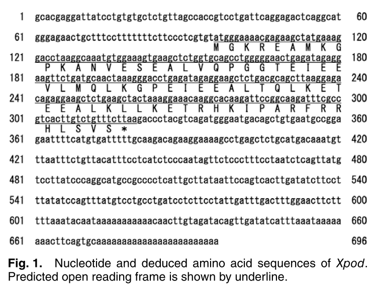
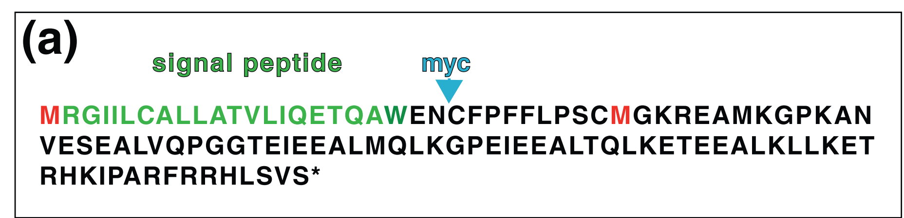
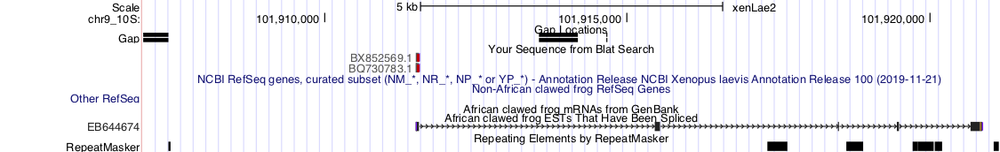

```{r setup, include=FALSE}
knitr::opts_chunk$set(echo = TRUE)
#knitr::opts_knit$set(root.dir = '/proj/cdjones_lab/csoeder/xenop/')
knitr::opts_knit$set(root.dir = '/Users/csoeder/Research/xPlod/')
#knitr::opts_knit$set(root.dir=peaDubDee)
#library("ggbio")
#library("biomaRt")
#library("org.Dm.eg.db")
library("yaml")
library("readr")
library("tidyverse")
library("gt")
library("bib2df")
library("magrittr")
library("UpSetR")
library("grid")
library("msa")
library("ggbio")
library("rtracklayer")

```


```{r echo=FALSE, include=FALSE, message=FALSE}


#tbl_cnt <- tbl_cnt + 1
#thing.gt <- asdfasdfasd  %>%  gt() %>% tab_header(title=paste("Table ",tbl_cnt, ". table title", sep = ""), subtitle="table subtitle") 


#thing.gt
#write(thing.gt %>%  as_raw_html(), paste("results/tables/tbl",tbl_cnt,"_thing.html", sep=""))


```

```{r echo=FALSE, include=FALSE, message=FALSE}


# fig_cnt <- fig_cnt + 1
# thing.gg <- asdfasdfasd
# thing.gg
# png(height =  500, width = 800, filename = paste("results/figures/fig",fig_cnt,"_ong.png", sep=""))
# thing.gg
# dev.off()
# 

```


```{r include=FALSE}

human_readable_croncher <- function(num_in) {
	dig <- 3
	num_out <- formatC(num_in, digits=dig, format='g') %>% as.numeric() %>% sitools::f2si()
	return(num_out)
}

bam_summary_loader <- function(filename, aligner="mapsplice", reference='dm6'){
	
	tmp.df <- read_delim(filename, "\t", escape_double = FALSE, col_names = FALSE, trim_ws = TRUE)
	names(tmp.df) <- c("sample","measure","value")
	
	tmp.df$sample <- as.factor(tmp.df$sample)
	tmp.df$measure <- as.factor(tmp.df$measure)
	tmp.df$aligner <- as.factor(aligner)
	tmp.df$reference <- as.factor(reference)
	
	return(tmp.df)
	
}


fmt_citation <- function(bibtex_in) {
	bibdf <- bib2df::bib2df(bibtex_in,separate_names = TRUE)

	bibdf.unnest <- bibdf  %>% unnest(cols=c("AUTHOR"))
	bibdf.counts <- bibdf.unnest %>% group_by(BIBTEXKEY) %>% summarise(num_auth = n())

	bibdf.rejoin <- inner_join(bibdf.unnest, bibdf.counts, by=c("BIBTEXKEY"="BIBTEXKEY"))

	bibdf.join <- rbind( bibdf.rejoin %>% filter(num_auth == 1 )%>% ungroup() %>% select(c("BIBTEXKEY", "full_name", "YEAR")),bibdf.rejoin %>% filter(num_auth == 2 ) %>% group_by(BIBTEXKEY) %>% mutate(full_name =paste0(full_name, collapse = " & ")) %>% ungroup() %>% select(c("BIBTEXKEY","full_name", "YEAR")),bibdf.rejoin %>% filter(num_auth > 2 )%>% group_by(BIBTEXKEY) %>% summarise(first_auth = head(full_name, 1), full_name=paste(first_auth, "et al. "), YEAR=unique(YEAR)) %>% ungroup() %>% select(c("BIBTEXKEY","full_name", "YEAR"))) %>% ungroup() %>% mutate(cite = paste(full_name, YEAR, sep = " "))  %>% select(c(BIBTEXKEY, cite)) %>%  unique()# %>% group_by(BIBTEXKEY) %>% summarise(citation = paste0(cite, collapse = "; ")) %>% ungroup()

	return(bibdf.join)
}
fig_cnt <- 0
tbl_cnt <- 0


#marty <- useDataset("dmelanogaster_gene_ensembl",  useMart("ensembl",  host = "useast.ensembl.org") )
#G_list <- getBM(attributes= c("flybase_gene_id", "external_gene_name"), mart= marty) 
```


# Introduction

Explain motivation, overview


@Kurrle2020

xPod was identified in @Yoshii2011 by searching the XDB3 X. laevis EST database (Japans' National Institute for Basic Biology, http://xenopus.nibb.ac.jp/ ) for interesting transcription patterns. The EST XL083j13 was identified as having mosaic transcription in the epidermis. 

```{r echo=FALSE, include=T, message=FALSE, results="asis", eval=F}

#

test <- readDNAStringSet("utils/XL083j13.fa")

test_aln <- msa(test, "ClustalOmega")
msaPrettyPrint(test_aln, output="asis",showLogo="none", askForOverwrite=FALSE, consensusColors = "BlueRed",shadingMode="identical",shadingColors="blues",)

#msaPrettyPrint(test_aln, output="asis",showNames="none", showLogo="none", askForOverwrite=FALSE)

```

@Yoshii2011 then sequenced the mRNA, stating "The cDNA contained 969 nucleotides and predicted open reading flame[sic] consisting of 225 nucleotides." This was depicted in their Figure 1. 



The gene structure was updated in @Kurrle2020, which "detected a 5' extended reading frame, which added 32 amino-acids to the N-terminus of the published protein, giving rise to a final size of 107 amino-acids", depicted in their figure 1. The 5' extension included a signal peptide sequence, suggestion secretion. This was confirmed by putting a "myc tag" 3' to the signal peptide and 5' to the start codon. The source ESTs include the 3' UTR extending to the poly-A tail, which includes a second, 48-AA ORF (no similarity detected with NCBI tblastn to nr db). However, it only contains the last dozen or so nucleotides of the 5' UTR.



The ESTs from @Kurrle2020 were examined; they differ primarily in the length of the 3' UTR:


```{r echo=FALSE, message=FALSE, warning=FALSE}


Kurrle2020_ESTs_geneModel.bed <-import("utils/Kurrle2020_ESTs_geneModel.bed", format = "BED") 


fig_cnt <- fig_cnt + 1
Kurrle2020_ESTs_geneModel <- autoplot(Kurrle2020_ESTs_geneModel.bed, aes(fill=name)) + facet_grid(seqnames~.) + theme_bw() + labs(title=paste("Figure ",fig_cnt,". Comparison of Gene Structure in Source\n(Kurrle et al. (2020)) ESTs"), x = "Location in Transcript") + scale_fill_discrete( name = "feature")
Kurrle2020_ESTs_geneModel
# thing.gg
# png(height =  500, width = 800, filename = paste("results/figures/fig",fig_cnt,"_ong.png", sep=""))
# thing.gg
# dev.off()
# 


```


@Yoshii2011 used an RNA hybridization probe to detect XPOD expression, showing a spotty distribution in the developing embryo which declines after the tailbud appears and disappears before metamorphosis. Antibody staining was used to confirm that translation occurs and that the RNA-probe and the peptide probe cooccur. Cultured cells of ectodermal origin were found to strongly express xpod. There are ciliated cells in the Xenopus epidermis with a similar distribution; labelling with antibodies/RNA probes for Xpod and Tubulin showed that some ciliated cells express Xpod, but most Xpod-expressing cells are not ciliated. Xpod was found to be expressed in ionocytes, cells responsible for chemostasis. Xpod is downregulated by an ionocyte marker foxi1e (homolog to zebrafish ionocyte marker foxi3), but xpod has no impact on foxi1e. Xpod expression responds to osmotic conditions. The cell type expressing it is identified as "small scattered cells"

@Kurrle2020 discusses SSCs, "small secretory cells", as they call them, which are responsible for exuding mucus. They secrete a xenopus-specific mucin (MucXS) as well as serotonin and antibacterials. Xpod is identified as "a reliable, strong and specific SSC marker." @Yoshii2011 Found no impact of Notch on Xpod expression, but this study found that it does increase SSCs carrying Xpod. Xpod was blocked with morpholino, +/- a rescue construct. They rule out early role in cell determination, as well as ciliogenesis. The morpholino was found to reduce the number & size of MucXS and serotonin granules, and the rescue brought the numbers back. Morpholino had no impact on embryo survival. Find that it does cause impaired ciliary beating by reducing serotonin expression. 

The evolutionary origins of XPOD are not clear; a lack of detectable similarity to outgroups makes it an orphan gene. Here's @Yoshii2011:

```
To date, no homologous genes in other organisms have been registered 
in the GenBank. Thus, we named this gene Xenopus polka dots (Xpod). [...]
As far as we know, the homologous genes for Xpod have not been reported
in other creatures. In addition, there are no characteristic domains
in the pre- dicted Xpod protein
```

Here's @Kurrle2020:

```
Xpod represents a secreted protein, which so far has no homologous
counterparts in other vertebrates. [...] homologous gene products 
were not present in genomes of other vertebrates, including its sister
species Xenopus tropicalis [...] At first glance, it is surprising
that Xpod has no vertebrate homolog, not even in its sister species
Xenopus tropicalis. [...] This raises the question on the evolutionary
origin of Xpod. All amphibian genomes, including both Xenopus species,
are far from being completely assembled, suggesting that Xpod-like
sequences might still be revealed. The mammalian data- bases have
been completed at high resolution, which might indicate that Xpod
could be restricted to lower vertebrates. In evolutionary terms, this
scenario has the highest probability. On the other hand, our failure
to identify homologs could also indicate that Xpod might be a gene
specific to Xenopus laevis. Surely, it is hard to imagine how such
a species-specific protein could evolve and obtain a crucial function
in secretion just once. [...] Even if genomic sequences would accidentally
become under the con- trol of an SSC specific promotor, a functional
impact on a specific cellular process is still highly unlikely. To our
knowledge, de novo gene emergence in a single species has not been
reported before.
```

A combination of reference genome quality and lack of database annotation has prevented understanding of the gene's evolution:

```
Unexpectedly, Xpod was not annotated in the Xenopus database Xenbase (Karimi et al., 2018). By homology search we obtained multiple expressed sequence tags (ESTs) but no relevant genomic hits [...] Although the precise Xpod genomic loci are currently not available, Xpod cDNA fragments match to Xenopus laevis chromosomes 9_10L and S. In Xenopus tropicalis, two homolo- gous but distinct chromosomes 9 and 10 exist, thus chromosome 9_10 reflects an initial fusion result (Matsuda et al., 2015; Session et al., 2016), which potentially could create a species-specific gene product.
```


# Materials, Methods, Data, Software

```{r include=FALSE}

trammel <- read_yaml("config.yaml")

```

## Reference Genomes
```{r include=FALSE, echo=FALSE}
ref_genomes.cfg.df <- plyr::ldply(trammel$reference_genomes, data.frame)

reference_genomes_summaryStats <- read_delim("summaries/reference_genomes.summary", "\t", escape_double = FALSE, col_names = FALSE, trim_ws = TRUE)

names(reference_genomes_summaryStats) <- c("refGenome","measure","value")
```

```{r echo=FALSE, message=FALSE, warning=FALSE}

tbl_cnt <- tbl_cnt + 1

refGenomes_summary.gt <- reference_genomes_summaryStats  %>% mutate(measure=gsub("_"," ",measure)) %>% spread(refGenome, value)   %>% gt() %>% tab_header(title=paste("Table ",tbl_cnt, ". Size and Consolidation of Reference Genomes", sep = ""), subtitle="Xenopus laevis & tropicalis") %>%   fmt_number(columns = vars(xenLae2, xenTro9),suffixing = TRUE, decimals=1) %>% cols_label(measure = " ", )
	
refGenomes_summary.gt

#write(refGenomes_summary.gt %>%  as_raw_html(), paste("results/tables/tbl",tbl_cnt,"_refGenomeSummary.html", sep=""))

```


The source ESTs used in @Kurrle2020 were aligned to the tropicalis and laevis using BLAT. These were filtered for quality by requiring at least 50% of the query sequence and at least 50 nt were maapped. 


```{r echo=FALSE, message=FALSE, warning=FALSE}

source_ESTs_blat_vs_xenLae2 <- read_delim("scans/background/source_ESTs.blat.vs_xenLae2.mapt.psl", "\t", escape_double = FALSE, col_names = FALSE, trim_ws = TRUE)
names(source_ESTs_blat_vs_xenLae2) <- c("matches","misMatches","repMatches","nCount","qNumInsert","qBaseInsert","tNumInsert","tBaseInsert","strand","qName","qSize","qStart","qEnd","tName","tSize","tStart","tEnd","blockCount","blockSizes","qStarts","tStarts")


source_ESTs_blat_vs_xenLae2.filt <- read_delim("scans/background/source_ESTs.blat.vs_xenLae2.mapt.filt.psl", "\t", escape_double = FALSE, col_names = FALSE, trim_ws = TRUE)
names(source_ESTs_blat_vs_xenLae2.filt) <- c("matches","misMatches","repMatches","nCount","qNumInsert","qBaseInsert","tNumInsert","tBaseInsert","strand","qName","qSize","qStart","qEnd","tName","tSize","tStart","tEnd","blockCount","blockSizes","qStarts","tStarts")

source_ESTs_blat_vs_xenTro9 <- read_delim("scans/background/source_ESTs.blat.vs_xenTro9.mapt.psl", "\t", escape_double = FALSE, col_names = FALSE, trim_ws = TRUE)
names(source_ESTs_blat_vs_xenTro9) <- c("matches","misMatches","repMatches","nCount","qNumInsert","qBaseInsert","tNumInsert","tBaseInsert","strand","qName","qSize","qStart","qEnd","tName","tSize","tStart","tEnd","blockCount","blockSizes","qStarts","tStarts")

```

The search of the xenTro9 reference genome found `r nrow(source_ESTs_blat_vs_xenTro9)` raw hits. In the xenLae2 reference, `r nrow(source_ESTs_blat_vs_xenLae2)` raw hits were found:

```{r echo=FALSE, include=T, message=FALSE}


tbl_cnt <- tbl_cnt + 1
sequenced_counts.DNA.gt <- 
	source_ESTs_blat_vs_xenLae2 %>% mutate(fraction_mapped = (qEnd-qStart)/qSize, ) %>% select(c("qName","tName","tStart","tEnd","strand","blockCount","fraction_mapped")) %>% group_by(qName) %>% arrange(fraction_mapped) %>% gt() %>% tab_header(title=paste("Table ",tbl_cnt, ". BLAT hits for xpod EST Search", sep = ""), subtitle="X. laevis xenLae2 reference, unfiltered") %>%   fmt_percent(columns = vars(fraction_mapped), decimals=1) %>% cols_label( tName=" ", tStart="start", tEnd = "end", blockCount = "# exon blocks", fraction_mapped = "% of EST mapped")

sequenced_counts.DNA.gt
#write(sequenced_counts.gt %>%  as_raw_html(), paste("results/tables/tbl",tbl_cnt,"_sequencedSampleCount.html", sep=""))


```

These hits are not very good: none of them map more than a quarter of the query sequence, and the hits to the chrUn* contigs occur at the very ends of the contig. `r nrow(source_ESTs_blat_vs_xenLae2.filt)` of these mappings passed the quality filter. 


```{r echo=FALSE, message=FALSE, warning=FALSE}


xenLae2.EST.queryCoverage.bed <-import("scans/background/source_ESTs.blat.vs_xenLae2.mapt.queryCoverage.bed", format = "BED") 


fig_cnt <- fig_cnt + 1
xenLae2.EST.queryCoverage.gg <- autoplot(xenLae2.EST.queryCoverage.bed, aes(fill=name)) + facet_grid(seqnames~.) + theme_bw()+ labs(title=paste("Figure ",fig_cnt,". Regions of Source (Kurrle et al. (2020)) ESTs\nMappable to xenLae2 Reference"), x = "Location in Transcript")+ scale_fill_discrete( name = "contig mapped to")
xenLae2.EST.queryCoverage.gg

# png(height =  500, width = 800, filename = paste("results/figures/fig",fig_cnt,"_ong.png", sep=""))
# thing.gg
# dev.off()
# 
```

These hits are to the very 5' and 3' ends of the EST. The chrUn_* hits are to the very edges of the contigs. The chr9_10L hit is to the middle of nowhere, near one end of the chromosome. UCSC Genome Browser BLAT also finds another hit: chr9_10S:101,911,505-101,911,561 . This is in a ~6kb region in between two sequencing gaps. There are no annotated genes in the vicinity, but the BLAT hit overlaps a spliced EST, EB644674 (https://www.ncbi.nlm.nih.gov/nuccore/EB644674 ). This thymus-derived EST maps out of the inter-gap region and contains 5 exons. There is a sequencing gap in the first intron, and there is a family of DNA repetitive elements (hAT-Ac) with another element (Kolobok-T2) directly downstream. 




xclustal alignment of EB644674 with either BQ730783.1 or BX852569.1 found no sequence similarity to speak of. 

## Sequenced Reads

```{r include=FALSE}
data_sets.df <- plyr::ldply(trammel$data_sets, data.frame)


# data_sets.df$name <- as.factor(data_sets.df$name)
# data_sets.df$paired<- as.factor(data_sets.df$paired)
# data_sets.df$experimental<- as.factor(data_sets.df$experimental)
# data_sets.df$species<- as.factor(data_sets.df$species)
# data_sets.df$source<- as.factor(data_sets.df$source)


data_sets.df.sparse <- data_sets.df %>% select(-c(starts_with("readsfile"), "SRA", "path")) %>% filter(subgroups=="all") %>% distinct() 

#data_sets.df.sparse.collapse <- data_sets.df.sparse %>% group_by(name) %>%  mutate(genotype = paste0(as.character(genotype), collapse = "," ))  %>% distinct()
#data_sets.df.sparse.collapse$genotype <- as.factor(data_sets.df.sparse.collapse$genotype)

WGS.counts.tbl  <- data_sets.df.sparse %>% filter(molecule=="DNA") %>% group_by(species, sex) %>% summarise(sample_count=n())


```

```{r echo=FALSE, include=T, message=FALSE}


tbl_cnt <- tbl_cnt + 1
sequenced_counts.DNA.gt <- WGS.counts.tbl %>% ungroup()%>% gt() %>% tab_header(title=paste("Table ",tbl_cnt, ". WGS Samples Downloaded from NCBI", sep = ""), subtitle="counts by species") %>%   fmt_number(columns = vars(sample_count),suffixing = TRUE, decimals=0) %>% cols_label( sample_count="number sequenced")

sequenced_counts.DNA.gt
#write(sequenced_counts.gt %>%  as_raw_html(), paste("results/tables/tbl",tbl_cnt,"_sequencedSampleCount.html", sep=""))


```


### Pre-processing

```{r echo=FALSE, include=FALSE}
fastp_summary <- read_delim("summaries/sequenced_reads.dat", "\t", escape_double = FALSE, col_names = FALSE, trim_ws = TRUE)
names(fastp_summary ) <- c("name","type","measure","value")
fastp_summary$name <- as.factor(fastp_summary$name)
fastp_summary$type <- as.factor(fastp_summary$type)
fastp_summary$measure <- as.factor(fastp_summary$measure)
```

```{r echo=FALSE, include=FALSE}
filtration_stats <- inner_join(fastp_summary %>%  filter(type=="prefiltered" | type == 'postfiltered'), data_sets.df.sparse, by=c("name"="name"))
filtration_stats$type <- factor(filtration_stats$type, levels=c("prefiltered", "postfiltered"))
```

These reads were preprocessed with FASTP [@Chen2018] for quality control and analytics. 

Starting FASTQ files contained a total of  $`r sum( filtration_stats %>% filter(type =='prefiltered') %>%  filter(measure=='total_reads') %>% select(value) ) %>% human_readable_croncher() `$ reads; after QC, this dropped to $`r sum( filtration_stats %>% filter(type =='postfiltered') %>%  filter(measure=='total_reads') %>% select(value) ) %>% human_readable_croncher() `$. 

```{r echo=FALSE}
pre_post_counts <- filtration_stats %>% filter(measure=='total_reads') %>%  group_by(type)  %>%  summarise(minimum = min(value), average=mean(value) , maximum = max(value)) 
retention_percent <- filtration_stats %>% filter(measure=='total_reads') %>% select(c(name,type,value)) %>%  spread(type,value) %>% mutate(retention=100*postfiltered/prefiltered) %>%  summarise(type='percent retention', minimum = min(retention), average=mean(retention) , maximum = max(retention))
```

```{r echo=FALSE}

read_retention_rate.gt <- rbind(pre_post_counts, retention_percent)  %>% gt() %>% tab_header(title=paste("Table ",tbl_cnt, ". Read Retention Rate during Preprocessing", sep = ""), subtitle= md("&nbsp;")) %>%  fmt_number(columns = vars(minimum, average,maximum),rows = type!="percent_retention",suffixing = TRUE, decimals=0) %>% fmt_percent(columns = vars(minimum, average,maximum),rows = type=="percent_retention", decimals=1) %>% cols_label(type=" ") 

read_retention_rate.gt

#write(read_retention_rate.gt %>%  as_raw_html(), paste("results/tables/tbl",tbl_cnt,"_readRetentionRatePreprocessing.html", sep=""))

```

Filtration also increased the read quality, as seen in the increase in the fraction of reads with an average quality score > 30:

```{r echo=FALSE, message=FALSE, warning=FALSE}
fig_cnt <- fig_cnt + 1

readQual.gg <- ggplot(filtration_stats %>% filter(measure == "q30_rate")) + geom_line(aes(group=name, x=type,y=100*value)) +  geom_point(aes(x=type, y = 100*value, color=species, shape=sex)) + labs(title = paste("Figure ",fig_cnt, ". Percent of Reads with a mean QUAL > 30", sep = ""), y="Percent QUAL > 30", x="") + theme_bw() #+ geom_text(data= . %>% filter(type=="postfiltered") %>% filter(value<0.97), aes(type,100*value,label=name))

readQual.gg
#png(height =  500, width = 800, filename = paste("results/figures/fig",fig_cnt,"_readQualityThruProcessing.png", sep=""))
#readQual.gg
#dev.off()


```

Duplicate reads were also detected; these will be filtered during alignment:

Duplicate reads were also detected

```{r echo=FALSE, message=FALSE, warning=FALSE}
dupe_stats <- inner_join(fastp_summary %>% filter(type=='duplication' & measure =='rate') %>%  mutate(percent=value) %>% select(c(name,percent)), data_sets.df.sparse, by=c("name"="name"))
```

```{r echo=FALSE, message=FALSE, warning=FALSE}
tbl_cnt <- tbl_cnt + 1

duplicationStats.gt <- dupe_stats %>%  summarise(minimum = min(percent), average=mean(percent), median=median(percent) , maximum = max(percent)) %>% gt() %>% tab_header(title=paste("Table ",tbl_cnt, ". Percentage Duplication", sep = ""), subtitle="FASTP estimate") %>% fmt_percent(columns=vars(minimum,median,average,maximum), decimals=1, ) #kable(caption="Percentage Duplication",digits=1)

duplicationStats.gt

#write(duplicationStats.gt %>%  as_raw_html(), paste("results/tables/tbl",tbl_cnt,"_duplicationStats.html", sep=""))

```


```{r echo=FALSE, message=FALSE, warning=FALSE}
fig_cnt <- fig_cnt + 1

dupeStats.gg <- ggplot(dupe_stats) + geom_histogram(aes(x=100*percent, fill=species), bins=15) + labs(title=paste("Figure ",fig_cnt, ". Duplication Histogram (FASTP estimate)", sep = ""), x="Read Duplication Rate (percent)", y="Number Samples") + theme_bw()

dupeStats.gg
#png(height =  500, width = 800, filename = paste("results/figures/fig",fig_cnt,"_readDuplicationRate.png", sep=""))
#dupeStats.gg
#dev.off()


```

## Genome Assembly

SPADES [@Bankevich2012] was used to assemble genomes from the WGS reads used above using default settings. QUAST [@Mikheenko2018] was used to assess assembly quality, using the settings "--eukaryote  --fragmented" and the tropicalis/laevis genomes as reference based on source (what to do with hybrids samples?)

The output of QUAST is documented in the manual: http://quast.sourceforge.net/docs/manual.html

```{r echo=FALSE, message=FALSE, warning=FALSE}

genome_assembly.meta <- read_delim("summaries/genome_assembly.summary", "\t", escape_double = FALSE, col_names = FALSE, trim_ws = TRUE)
names(genome_assembly.meta) <- c("sample","measure", "value")
genome_assembly.meta.aug <- inner_join(genome_assembly.meta, data_sets.df.sparse, by = c("sample"="name")) 


```

### contig number & size

"# contigs is the total number of contigs in the assembly."

```{r echo=FALSE, message=FALSE, warning=FALSE}


genome_assembly.size_dist <- genome_assembly.meta %>% filter(startsWith(measure, "# contigs ")) %>% separate(col=measure, into=c("null1","null2","bound")) %>% mutate(bound=as.numeric(bound), value=as.numeric(value) ) %>% select(-starts_with("null"))


fig_cnt <- fig_cnt + 1
genome_assembly.size_dist.gg <- ggplot(genome_assembly.size_dist) +  geom_line(aes(x=bound, group=sample, color=sample, y=value)) + scale_x_log10() +scale_y_log10()+ labs(title=paste("Figure ",fig_cnt, ". Distribution of SPADEs Contigs by Assembly", sep = ""), x="Contig Size Threshold (bp)", y="Number Contigs Larger than Threshold") + theme_bw()

genome_assembly.size_dist.gg
#png(height =  500, width = 800, filename = paste("results/figures/fig",fig_cnt,"_readDuplicationRate.png", sep=""))
#dupeStats.gg
#dev.off()


```

"N50 is the length for which the collection of all contigs of that length or longer covers at least half an assembly."


### assembly size

"Total length is the total number of bases in the assembly.
Reference length is the total number of bases in the reference genome."


```{r echo=FALSE, message=FALSE, warning=FALSE}

genome_assembly.size <- genome_assembly.meta.aug %>% filter(measure %in% c("Total length","Reference length")) %>% select(c(sample, measure, value, species)) 


tbl_cnt <- tbl_cnt + 1
genome_assembly.size.gt <- genome_assembly.size %>% mutate(measure=gsub(" ","_",measure), value=as.numeric(value)) %>% spread(key = measure, value=value) %>%  mutate(fraction_rebuilt = Total_length/Reference_length, Reference_length = human_readable_croncher(Reference_length)) %>% group_by(species, Reference_length) %>% gt() %>% tab_header(title=paste("Table ",tbl_cnt, ". Size of Assemblies compared to Reference", sep = ""), subtitle=" ") %>% fmt_percent(columns=c("fraction_rebuilt")) %>% fmt_number(columns = c("Total_length"), suffixing = T, decimals = 2)
genome_assembly.size.gt
#write(thing.gt %>%  as_raw_html(), paste("results/tables/tbl",tbl_cnt,"_thing.html", sep=""))
```

Why does the "Total length (>= 0 bp)" != "Total Length"?

```{r echo=FALSE, message=FALSE, warning=FALSE}


genome_assembly.cumSize_by_asmblLen.dist <- genome_assembly.meta %>% filter(startsWith(measure, "Total length ")) %>% separate(col=measure, into=c("null1","null2","bound")) %>% mutate(bound=as.numeric(bound), value=as.numeric(value) ) %>% select(-starts_with("null"))


fig_cnt <- fig_cnt + 1
genome_assembly.cumSize_by_asmblLen.dist.gg <- ggplot(genome_assembly.cumSize_by_asmblLen.dist) +  geom_line(aes(x=bound, group=sample, color=sample, y=value)) + scale_x_log10() +scale_y_log10()+ labs(title=paste("Figure ",fig_cnt, ". Total Assembly Length, by Size of Contributing Transcripts", sep = ""), x="Contig Size Threshold (bp)", y="Number Contigs Larger than Threshold") + theme_bw()

genome_assembly.cumSize_by_asmblLen.dist.gg
#png(height =  500, width = 800, filename = paste("results/figures/fig",fig_cnt,"_readDuplicationRate.png", sep=""))
#dupeStats.gg
#dev.off()


```
"N50 is the length for which the collection of all contigs of that length or longer covers at least half an assembly. ... L50 is the number of contigs equal to or longer than N50 ... 
In other words, L50, for example, is the minimal number of contigs that cover half the assembly."

```{r echo=FALSE, message=FALSE, warning=FALSE}

genome_assembly.50 <- genome_assembly.meta.aug %>% filter(measure %in% c("N50", "L50")) %>% select(c(sample, measure, value, species)) 


tbl_cnt <- tbl_cnt + 1
genome_assembly.50.gt <- genome_assembly.50 %>% mutate(value=as.numeric(value)) %>% spread(key=measure, value=value) %>% group_by(species) %>% gt() %>% tab_header(title=paste("Table ",tbl_cnt, ". Assembly N50 and L50 Values", sep = ""), subtitle=" ")  %>% fmt_number(columns = c("N50" ), suffixing = T, decimals =1)  %>% fmt_number(columns = c("L50"), suffixing = T, decimals =0) %>% cols_label(sample="", L50 = "L50 (#)", N50 = "N50 (bp)")
genome_assembly.50.gt
#write(thing.gt %>%  as_raw_html(), paste("results/tables/tbl",tbl_cnt,"_thing.html", sep=""))
```


```{r echo=FALSE, message=FALSE, warning=FALSE, eval=F}

genome_assembly.L50 <- genome_assembly.meta.aug %>% filter(measure =="L50") %>% select(c(sample, measure, value, species)) 


tbl_cnt <- tbl_cnt + 1
genome_assembly.L50.gt <- genome_assembly.L50 %>% mutate(value=as.numeric(value)) %>% spread(key=measure, value=value) %>% group_by(species) %>% gt() %>% tab_header(title=paste("Table ",tbl_cnt, ". Assembly L50 Values", sep = ""), subtitle="(in basepairs)")  %>% fmt_number(columns = c("N50"), suffixing = T, decimals =1) %>% cols_label(sample="")
genome_assembly.n50.gt
#write(thing.gt %>%  as_raw_html(), paste("results/tables/tbl",tbl_cnt,"_thing.html", sep=""))
```


### GC Content

"GC (%) is the total number of G and C nucleotides in the assembly, divided by the total length of the assembly.
Reference GC (%) is the percentage of G and C nucleotides in the reference genome.
"


```{r echo=FALSE, message=FALSE, warning=FALSE}

genome_assembly.gc <- genome_assembly.meta.aug %>% filter(measure %in% c("GC (%)","Reference GC (%)")) %>% select(c(sample, measure, value, species)) %>% mutate(measure=case_when(measure=="GC (%)"~"GC", measure=="Reference GC (%)"~"reference_GC", T~measure), value=as.numeric(value)/100)


tbl_cnt <- tbl_cnt + 1
genome_assembly.gc.gt <- genome_assembly.gc  %>% spread(key=measure, value=value) %>% mutate(reference_GC = paste(100*reference_GC,"%")) %>% group_by(species, reference_GC)%>% gt() %>% tab_header(title=paste("Table ",tbl_cnt, ". GC Content of Assemblies compared to Reference", sep = ""), subtitle=" ")  %>% fmt_percent(columns = c("GC"),  decimals = 1) %>% cols_label(sample=" ")
genome_assembly.gc.gt
#write(thing.gt %>%  as_raw_html(), paste("results/tables/tbl",tbl_cnt,"_thing.html", sep=""))
```


## Scanning Assemblies for xPod

The genome assemblies above were searched for xPod.

The xPod CDS nucleotide sequence from @Kurrle2020 was used as a query with blastn and the translated peptide sequence was used as a query with tblastn; in both cases an e-value cutoff of 2 was used. 

```{r echo=FALSE, message=FALSE, warning=FALSE}

xpod_vs_assemblies <- read_delim("summaries/scans/xpod_vs_assemblies.stat", "\t", escape_double = FALSE, col_names = FALSE, trim_ws = TRUE)
names(xpod_vs_assemblies) <- c("species","sample","filter","sequence_type","hit_count")


#names() <- c("qseqid","sseqid","pident","length","mismatch","gapopen","qstart","qend","sstart","send","evalue","bitscore","sstrand")


```


```{r echo=FALSE, message=FALSE, warning=FALSE}

tbl_cnt <- tbl_cnt + 1
xpod_vs_assemblies.hitSummaries.gt <- xpod_vs_assemblies %>% group_by(species,filter, sequence_type) %>% summarize(total_hits=sum(hit_count), median_hits = median(hit_count), sample_count=n()) %>% ungroup() %>% gather(key="key", value="value", total_hits, median_hits) %>% unite(col=measure, sep=".", sequence_type, key) %>% spread(key=measure, value=value) %>% group_by(species) %>% gt() %>% tab_header(title=paste("Table ",tbl_cnt, ". BLAST Results: Searching for xPod in from-scratch Assembled Genomes ", sep = ""), subtitle="query sequence: CDS from Kurrle2020") %>% tab_spanner(label = "nucleotide search", columns = starts_with("nucleotide."))%>% tab_spanner(label = "peptide search", columns = starts_with("peptide")) %>% cols_label(sample_count = "number assemblies", filter="", nucleotide.median_hits = "median hits", peptide.median_hits = "median hits", nucleotide.total_hits = "total hits", peptide.total_hits = "total hits",)
xpod_vs_assemblies.hitSummaries.gt

#write(thing.gt %>%  as_raw_html(), paste("results/tables/tbl",tbl_cnt,"_thing.html", sep=""))
```
The locations of the BLAST hits are visualized across the CDS:


```{r echo=FALSE, message=FALSE, warning=FALSE}


xLae1.nuclBLAST.queryCoverage.bed <-import("scans/assemblies/spades/xLae1.nuclBLAST.queryCoverage.bed", format = "BED") 
xLae1.nuclBLAST.queryCoverage.bed$sample <- "xLae1"
xLae3.nuclBLAST.queryCoverage.bed <-import("scans/assemblies/spades/xLae3.nuclBLAST.queryCoverage.bed", format = "BED") 
xLae3.nuclBLAST.queryCoverage.bed$sample <- "xLae3"
nuclBLAST.queryCoverage.bed<-c(xLae1.nuclBLAST.queryCoverage.bed,xLae3.nuclBLAST.queryCoverage.bed)


fig_cnt <- fig_cnt + 1
nuclBLAST.queryCoverage.ggbio <- autoplot(nuclBLAST.queryCoverage.bed, aes(fill=name)) + facet_grid(sample~.) + geom_vline(xintercept = 60, color = "red", label="signal peptide") + theme_bw()  + theme(legend.position = "none")+ labs(title=paste("Figure ",fig_cnt,". Mappability of Kurrle et al. (2020) CDS to Assembled Genomes\nshaded by contig mapped to; signal peptide indicated with vertical line"), x = "Location in Coding DNA Sequence")

nuclBLAST.queryCoverage.ggbio

# thing.gg
# png(height =  500, width = 800, filename = paste("results/figures/fig",fig_cnt,"_ong.png", sep=""))
# thing.gg
# dev.off()
# 


```


All of the CDS can be found mapped in at least one assembly, and almost all in both. Adjacent alignment blocks tend to map to the same assembly contig. Total ordering hasn't been checked but there is no obvious interleaving, and the sequence generally maps uniquely. The results seem to indicate the CDS is broken into 7 exons.


The @Kurrle2020 EST sequences were also blasted against the assemblies. 


```{r echo=FALSE, message=FALSE, warning=FALSE}


xLae1.estBLAST.queryCoverage.bed <-import("scans/assemblies/spades/xLae1.estBLAST.queryCoverage.bed", format = "BED") 
xLae1.estBLAST.queryCoverage.bed$sample <- "xLae1"
xLae3.estBLAST.queryCoverage.bed <-import("scans/assemblies/spades/xLae3.estBLAST.queryCoverage.bed", format = "BED") 
xLae3.estBLAST.queryCoverage.bed$sample <- "xLae3"
estBLAST.queryCoverage.bed<-c(xLae1.estBLAST.queryCoverage.bed,xLae3.estBLAST.queryCoverage.bed)


fig_cnt <- fig_cnt + 1
estBLAST.queryCoverage.ggbio <- autoplot(estBLAST.queryCoverage.bed, aes(fill=name)) + facet_grid(sample~seqnames) + theme_bw() + theme(legend.position = "none") + labs(title=paste("Figure ",fig_cnt,". Mappability of Kurrle et al. (2020) ESTs to Assembled Genomes\nshaded by contig mapped to"), x = "Location in EST")
estBLAST.queryCoverage.ggbio


# png(height =  500, width = 800, filename = paste("results/figures/fig",fig_cnt,"_ong.png", sep=""))
# thing.gg
# dev.off()
# 


```

This tends to confirm the 7-exon structure in the CDS, as well as one further splice sit  in the 3' UTR. There is too little of the 5' to be meaningful. The signal peptide sequence maps to two different sites in the xLae3 assembly, and the 3' most exon also has a secondary hit in both assemblies.

# Bibliography


